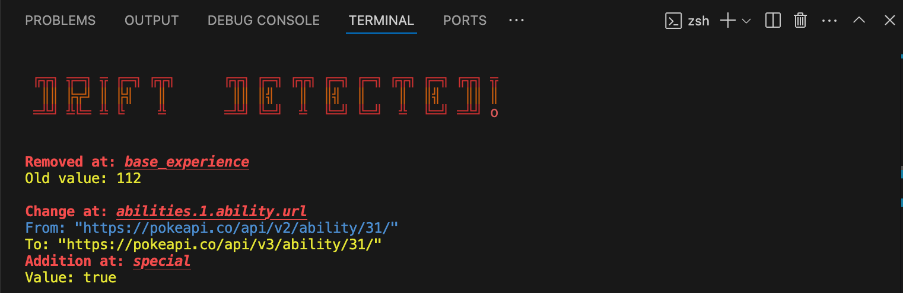

# Salmon... Code Salmon

A Typescript backend senior dev's most trusted gadget against the dastardly silent assassins known only as Rest API Contract Drift!  
Code Salmon is a CLI tool that scans TypeScript projects for REST API calls.  
Once identified and targetted, the calls are made to create a baseline json file for future comparisons.  
This will act as your bullet proof vest against vigilant assassin's attacks on your project.  
After some time has passed:

- Scan your project's Rest API calls again
- Compare the response results with your comparison data
- Make changes to your code to reflect the changing state of your API Calls

With Code Salmon, silent assassins like Rest API Contract Drift are no longer a threat and your codebase is not longer a victim.

## Problem Solved

Modern TypeScript projects often rely on external APIs. These APIs can change unexpectedly, causing "silent" issues in client applications.  
Code Salmon takes the guess work out by:

- Detecting API contract drift early
- Keeping track of all API dependencies and endpoints

## What does it do?

- Scans `.ts` source files for `fetch()` calls.
- Extracts API URLs and associated environment variables.
- Fetches and saves API responses as baseline in JSON file on local machine.
- Compares future API responses against saved baselines.
- Reports differences (contract drift) in response structures in the terminal.

## Configuration Tips

- Ensure your `.env` file is present in the root of the scanned project. It should contain all relevant API keys used via `process.env.KEY_NAME`.
- You can customize which files are included by modifying your `tsconfig.json` or structure. Currently, the tool scans all `.ts` files unless configured otherwise.

# Installation/ Set-up

Install CodeSalmon globally using npm:

```bash
 npm install codesalmon
```

Establish baseline for comparison:

```bash
scanSalmon
```

This baseline will be saved to a file in the user's local repository called:  
`.apiRestContracts.json`

To run the drift detection script:

```bash
swimSalmon
```

_Pro Tip:  
In order to produce accurate contract drift detection results, the user must wait (days, weeks, months) in between running `scanSalmon` and `swimSalmon`.  
The tool needs time to see if changes to Rest API's have been made._

# Contract Drift Report

CodeSalmon generates contract drift report each time the user runs swimSalmon in the terminal.

This detailed report identifies the type of drift, the value of drift, and where it was detected.

## Possible Drift Report Outputs

#### Changed at

- Displays which key/value pair has changed from and to. 

#### Addition at

- Gives the user a warning when an additional key/value pair is added to their response object.

#### Removed at

- Shows the user where a key/value pair may have experienced a removal.

#### Unhandled Change Type

- Will flag the user if the response object is reconfigured or an unexpected change in type to an array.

### If drift is detected:

_Figure 1: Contract drift report generated by CodeSalmon_  


### If NO drift is detected:

_Figure 2: Contract drift report with no drift generated by CodeSalmon_  


## Final Notes

Code Salmon identifies contract drift in Rest API Calls, it does NOT correct those changes.  
It is up to Developers to use this information how they choose.

## Contact

<table>
  <tr>
    <td align="center">
      
      <br />
      <sub><b>Anne Salim</b></sub>
      <br />
      <a href="https://www.linkedin.com/in/annesalim/">🖇️ LinkedIn</a>
    </td>
    <td align="center">
      
      <br />
      <sub><b>Marin Minamiya</b></sub>
      <br />
      <a href="https://www.linkedin.com/in/marin-minamiya/">🖇️ LinkedIn</a>
    </td>
    <td align="center">
      
      <br />
      <sub><b>Everett Merrill</b></sub>
      <br />
      <a href="https://www.linkedin.com/in/everett-merrill/">🖇️ LinkedIn</a>
    </td>
    <td align="center">
      
      <br />
      <sub><b>Jamie Tait</b></sub>
      <br />
      <a href="https://www.linkedin.com/in/jamiejtait/">🖇️ LinkedIn</a>
    </td>
  </tr>
</table>
